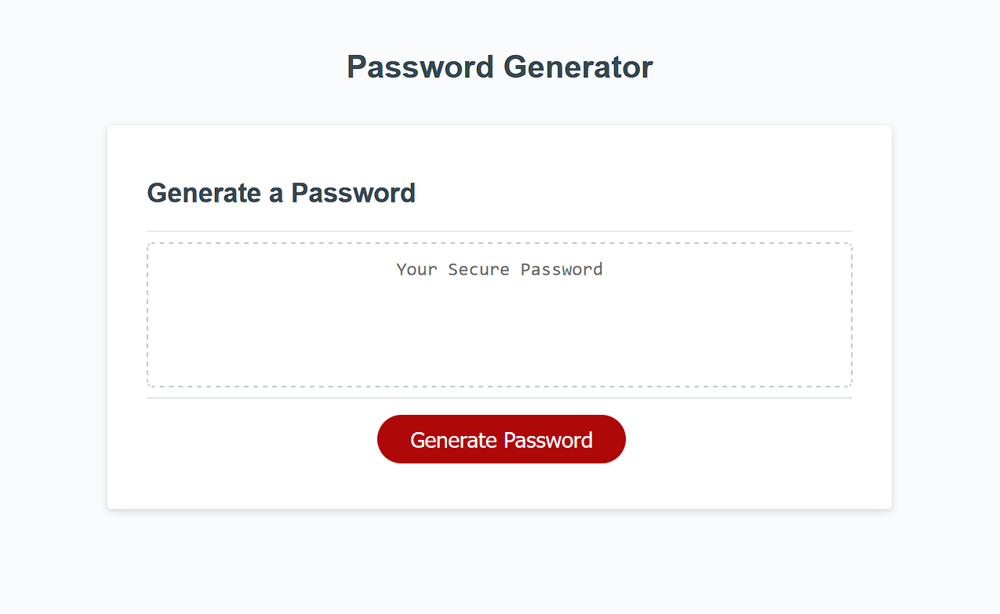

# Password Generator Starter Code

## Description
This site contains a simple password generator with options for password length and included characters. Passwords can be anywhere from 8 to 128 characters in length and include any combination of lowercase letters, uppercase letters, numbers, or special characters. Preemptive alerts are coded in in the event that a password is outside of the acceptable range, or if no group of characters is selected to be included in the password. 

## Screenshot

## Link to site
https://joshmusto.github.io/03-password-generator/